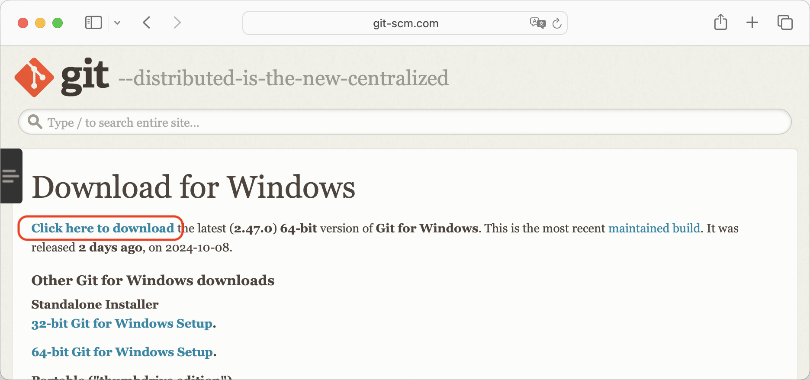
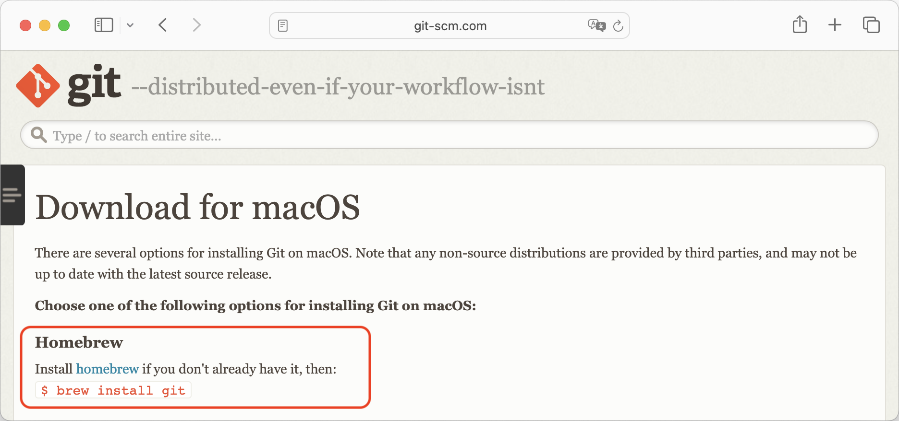

# 付録D 補足資料

- [（1章）Windows用のGitのインストール](#Windows用のGitのインストール)
- [（1章）macOS用のGitのインストール](#macOS用のGitのインストール)
- [（6章）HTTPSアクセスのセットアップ](#HTTPSアクセスのセットアップ)
  - [GitHubでの個人用アクセストークンの作成](#GitHubでの個人用アクセストークンの作成)
  - [Bitbucketでのアプリパスワードの作成](#Bitbucketでのアプリパスワードの作成)
- [（6章）SSHアクセスのセットアップ](#SSHアクセスのセットアップ)
  - [SSHのセットアップの例](#SSHのセットアップの例)
- [（7章）リモートリポジトリーの作成](#リモートリポジトリーの作成)
- [（12章）プルリクエスト（マージリクエスト）の作成](#プルリクエストマージリクエストの作成)

----

本稿は、本書のGitHubリポジトリー（<https://github.com/gitlearningjourney/learning-git>）の`README.md`ファイルを日本語に翻訳し、必要に応じて加筆・修正したものです。本書を読むうえでの補足資料として使用してください。なお、この内容は本書の日本語版の翻訳時点でのものですので、最新の情報については、上記のGitHubリポジトリーを参照してください。

## Windows用のGitのインストール

WindowsでGitをインストールするには、Gitの公式WebサイトでWindows用のダウンロードページ（<https://git-scm.com/download/win>）にアクセスします。このページには、Gitをダウンロードするための方法がいくつか提示されています。

本書のためには、最初に書かれているメインのダウンロードオプションを使ってGitをインストールすることを勧めます。［Click here to download］というリンクを選択すると、インストーラーがダウンロードされます<!-- （**図D-1**） -->。

このダウンロードオプションを使用することで、確実にバージョンが2.28以上であるGitがインストールされます。本書で紹介しているすべてのコマンドを使うためには、このバージョン以上であることが必要です。

次に、ダウンロードしたインストーラーを実行し、ステップバイステップでインストールプロセスを完了します。表示されるすべての画面でデフォルトの設定をそのまま受け入れ、［Next］をクリックして進みます。最後の画面で［install］をクリックすると、インストールが始まります。インストールが終わると完了画面が表示されるので、［Finish］を押して終了します。

Gitが正常にインストールされたかどうかをチェックするには、Git Bashのコマンドラインウィンドウを開き、`git version`コマンドを使ってGitのバージョンをチェックします。**実行手順D-1**に従って、これを確認してみましょう。

<!-- ---- -->

|　  |**実行手順D-1** |
|:-- |:--             |
|1.  |コマンドラインアプリケーションのGit Bashを検索し、コマンドラインウィンドウを開きます。 |
|2.  |`$` <strong>`git version`</strong> `git version 2.38.1.windows.1` |

<!-- ---- -->

#### 注目してほしいこと

* `git version`コマンドの出力結果は、インストールされたGitのバージョンを示しています。

これで、Windows用のGitのインストールが完了しました。

## macOS用のGitのインストール

macOSでGitをインストールするには、Gitの公式WebサイトでmacOS用のダウンロードページ（<https://git-scm.com/download/mac>）にアクセスします。このページには、Gitをダウンロードするための方法がいくつか提示されています。

本書のためには、Homebrewを使ってGitをインストールすることを勧めます<!-- （**図D-2**） -->。

Homebrewを使ってGitをインストールすることで、確実にバージョンが2.28以上であるGitがインストールされます。本書で紹介しているすべてのコマンドを使うためには、このバージョン以上であることが必要です。

Homebrewを使ってGitをインストールするには、まずHomebrewがインストール済みでなければなりません。Homebrewをまだインストールしていない場合は、**実行手順D-2**に進んでください。

<!-- ---- -->

|　  |**実行手順D-2** |
|:-- |:--             |
|1.  |HomebrewのWebサイト（<https://brew.sh/ja/>）にアクセスし、Homebrewをインストールするためのコマンド（「インストール」の下に書かれているコマンド）をコピーします。コマンドの右側にあるボタンをクリックすると、簡単にコピーできます。 |
|2.  |コマンドラインウィンドウを開き、ステップ1でコピーしたコマンドをペーストします。次のステップ3でこのコマンドを実行するときには、コマンドラインでのディレクトリーの場所は重要ではありません。 |
|3.  |`$` <strong>`/bin/bash -c "$(curl -fsSL https://raw.githubusercontent.com/Homebrew/install/HEAD/install.sh)"`</strong> `===> Checking for sudo access (which may request your password)...` `Password:` |
|4.  |パスワードを入力するように求められるので、自分のコンピューターでのユーザーパスワードを入力します。 |
|5.  |［Enter］キーを押して、インストールプロセスを完了します。 |
|6.  |`$` <strong>`brew --version`</strong> `Homebrew 3.6.7` `Homebrew/homebrew-core (git revision 4917c76d4d2; last commit 2022-10-29)` |

<!-- ---- -->

#### 注目してほしいこと

* ステップ6の出力結果は、インストールされたHomebrewのバージョンを示しています。

これでHomebrewがインストールできたので、次にGitをインストールします。そのためには、`brew install git`コマンドを使います。インストールが終わったら、`git version`コマンドを使って、インストールされたGitのバージョンをチェックします。**実行手順D-3**に従って、これらを実行してください。

<!-- ---- -->

|　  |**実行手順D-3** |
|:-- |:--             |
|1.  |`$` <strong>`brew install git`</strong> |
|2.  |`$` <strong>`git version`</strong> `git version 2.38.1` |

<!-- ---- -->

これで、macOS用のGitのインストールが完了しました。

## HTTPSアクセスのセットアップ

### GitHubでの個人用アクセストークンの作成

本書の6章では、ホスティングサービスを選択し、HTTPSまたはSSHプロトコルを介してリモートリポジトリーに接続するための認証情報をセットアップするよう指示されています。ホスティングサービスとしてGitHubを使用していて、HTTPSプロトコルを使用することに決めた場合は、個人用アクセストークンを作成する必要があります。

GitHubで個人用アクセストークンを作成する方法については、GitHub Docs - Creating a personal access token（<https://docs.github.com/en/authentication/keeping-your-account-and-data-secure/managing-your-personal-access-tokens#creating-a-personal-access-token-classic>）で参照できます。

> 訳注：日本語版ページ（<https://docs.github.com/ja/authentication/keeping-your-account-and-data-secure/managing-your-personal-access-tokens#personal-access-token-classic-%E3%81%AE%E4%BD%9C%E6%88%90>）

<!-- ---- -->

|　  |**訳者補：個人用アクセストークンの作成** |
|:-- |:--             |
|　  |個人用アクセストークンを作成するための手順を簡単に説明します。 |
|1.  |メールアドレスの検証が終わっていない場合は、まずメールアドレスを検証します。メールアドレスの検証が完了していないと、個人用アクセストークンは作成できません。詳しくは、GitHub Docsのページ（<https://docs.github.com/ja>）で「メールアドレスを検証する」と検索してください。 |
|2.  |GitHubで、任意のページの右上隅にある自分のプロフィール写真をクリックし、［Settings］をクリックします。 |
|3.  |左側のサイドバーで、［Developer settings］をクリックします。 |
|4.  |左側のサイドバーで、［Personal access tokens］の下にある［Tokens (classic)］をクリックします。 |
|5.  |［Generate new token］をクリックし、［Generate new token (classic)］をクリックします。 |
|6.  |［Note］フィールドで、トークンにわかりやすい名前を付けます。 |
|7.  |［Expiration］で、トークンの有効期限を設定します。既定の選択肢の中から選択するか、［Custom...］を選択して日付を入力します。 |
|8.  |［Select scopes］で、このトークンに付与するスコープを選択します。トークンを使ってコマンドラインからリポジトリーにアクセスするには、`repo`（リポジトリー）を選択します。スコープが割り当てられていないトークンでは、公開されている情報にのみアクセスできます。 |
|9.  |［Generate token］をクリックします。 |
|10. |生成されたトークンをコピーして保存します。 |

<!-- ---- -->

GitHubで個人用アクセストークンを作成する場合は、次のことに注意してください。

* ［Note］フィールドは、個人用アクセストークンの名前を表します。
* ［Expiration］で有効期限を選択するときには、最低でも、本書を読んで練習課題をやり終えるために必要な期間を設定することを勧めます。そうでないと、本書を読んでいる途中で個人用アクセストークンが期限切れになり、新しいトークンを作成するためのプロセスを実行しなければならなくなります。
* スコープ（scope）は、このトークンで何を行えるか、すなわち何が認証されるかを定義します。本書の目的のためには、少なくとも`repo`（リポジトリー）スコープを選択する必要があります。
* 個人用アクセストークンは安全な場所に保存してください。

<!-- ---- -->

> <big><big>💡</big></big>　個人用アクセストークンは、セキュリティ上の理由から、作成時に一度しか表示されません。そのため、安全な場所に保存しておく必要があります。

<!-- ---- -->

### Bitbucketでのアプリパスワードの作成

本書の6章では、ホスティングサービスを選択し、HTTPSまたはSSHプロトコルを介してリモートリポジトリーに接続するための認証情報をセットアップするよう指示されています。ホスティングサービスとしてBitbucketを使用していて、HTTPSプロトコルを使用することに決めた場合は、アプリパスワードを作成する必要があります。

Bitbucketでアプリパスワードを作成する方法については、Bitbucket Support - Create an App password（<https://support.atlassian.com/bitbucket-cloud/docs/create-an-app-password/>）で参照できます。

> 訳注：日本語版ページ（<https://support.atlassian.com/ja/bitbucket-cloud/docs/create-an-app-password/>）

Bitbucketでアプリパスワードを作成する場合は、次のことに注意してください。

* ［Label］フィールドは、アプリパスワードの名前を表します。
* 権限（permission）は、このアプリパスワードで何が認証されるかを表します。本書の目的のためには、少なくとも、アカウント（Account）、Workspace membership、プロジェクト（Projects）、リポジトリー（Repositories）、プルリクエスト（Pull Requests）の各セクションのオプションを選択する必要があります。
* アプリパスワードは安全な場所に保存してください。

<!-- ---- -->

> <big><big>💡</big></big>　アプリパスワードは、セキュリティ上の理由から、作成時に一度しか表示されません。そのため、安全な場所に保存しておく必要があります。

<!-- ---- -->

## SSHアクセスのセットアップ

本書の6章では、ホスティングサービスを選択し、HTTPSまたはSSHプロトコルを介してリモートリポジトリーに接続するための認証情報をセットアップするよう指示されています。SSHプロトコルを使用することに決めた場合は、それぞれのホスティングサービスでのセットアップ方法が書かれた次のリンクを参照してください。

##### GitHub

* GitHub Docs - Connecting to GitHub with SSH（<https://docs.github.com/en/authentication/connecting-to-github-with-ssh>）

> 訳注：日本語版ページ（<https://docs.github.com/ja/authentication/connecting-to-github-with-ssh>）

##### GitLab

* GitLab Docs - Use SSH keys to communicate with GitLab（<https://docs.gitlab.com/ee/user/ssh.html>）

> 訳注：クリエーションライン株式会社による日本語版ページ（<https://gitlab-docs.creationline.com/ee/user/ssh.html>）

##### Bitbucket

* Bitbucket Support - Set up an SSH key（<https://support.atlassian.com/bitbucket-cloud/docs/set-up-an-ssh-key/>）

> 訳注：日本語版ページ（<https://support.atlassian.com/ja/bitbucket-cloud/docs/configure-ssh-and-two-step-verification/>）

### SSHのセットアップの例

ここでは、SSHの一般的なセットアップの例を示します。うまくいかない場合や、一般的な例が当てはまらない場合は、ホスティングサービスの公式ドキュメントを参照することを勧めます。

SSHアクセスをセットアップするための主要なステップは、次の3つです。

1. 自分のコンピューター上でSSH鍵のペアを作成する。
2. SSHの秘密鍵をSSHエージェントに追加する。
3. SSHの公開鍵をホスティングサービスのアカウントに追加する。

#### ステップ1：自分のコンピューター上でSSH鍵のペアを作成する

SSH鍵にはさまざまな種類があり、そのうちのいくつかは他のものより安全であると考えられています。それぞれのホスティングサービスは、どの種類のSSH鍵を受け入れるかを文書で示しています。

本書の執筆時点で、3つの主要なホスティングサービスで受け入れられていて、最も安全と考えられているSSH鍵の種類は、`ed25519`です。ここで示すセットアップの例でも、これを使います。ただし、使用しているホスティングサービスで受け入れられているものであれば、どの種類の鍵でも利用できます。

SSH鍵のペアを作成するには、`ssh-keygen -t <ssh-key-type> -C "<email>"` コマンドを使います。`-t`オプションは「type」を表し、SSH鍵の種類を指定します。`-C`オプションはラベルを表します。ここではラベルとして、ホスティングサービスのアカウントで使用しているEメールアドレスを使います。

このコマンドを実行すると、どこに鍵を保存するかを尋ねられます。デフォルトの設定に従うことを勧めます。デフォルトでは、読者のホームディレクトリーの中に、`.ssh`という隠しディレクトリーが作成されます。隠しディレクトリーと隠しファイル、およびそれらの表示方法については、1章で学習したことを思い出してください。

<!-- ---- -->

> <big><big>💡</big></big>　これまでに自分のコンピューターでSSHをセットアップしたことがあるかどうか定かでない場合は、ホームディレクトリーに移動し、`.ssh`という隠しディレクトリーが存在するかどうかチェックしてください。

<!-- ---- -->

隠しディレクトリーの`.ssh`の中には、2つのファイルが作成されます。1つはSSHの秘密鍵のファイルであり、本書の例では`id_ed25519`です。もう1つはSSHの公開鍵のファイルであり、本書の例では`id_ed25519.pub`です。

次の図<!-- **図D-3**-->は、作成される`.ssh`ディレクトリーとファイルの例を示しています。

鍵を保存する場所を指定したら、次に、パスフレーズ（すなわちパスワード）を入力するよう求められます。パスフレーズは省略可能ですが、セキュリティ上の理由から、使用することを強く推奨します。

**実行手順D-4**に進み、SSHをセットアップするためのステップ1（SSH鍵のペアの作成）を完了してください。

<!-- ---- -->

|　  |**実行手順D-4** |
|:-- |:--             |
|1.  |`$` <strong>`ssh-keygen -t ed25519 -C "gitlearningjourney@gmail.com"}`</strong> `Generating public/private ed25519 key pair.` 　 `Enter file in which to save the key (/Users/annaskoulikari/.ssh/id_ed25519):` |
|2.  |デフォルトの場所に鍵を保存するために、そのまま［Enter］キーを押します。本書の例では、`/Users/annaskoulikari/.ssh/id_ed25519`というファイルに保存されます。  `Created directory '/Users/annaskoulikari/.ssh'.` 　 `Enter passphrase (empty for no passphrase):` |
|3.  |SSH鍵のパスフレーズ（すなわちパスワード）を入力します。  `Enter same passphrase again:` |
|4.  |確認のために、同じパスフレーズをもう一度入力します。  `Your identification has been saved in /Users/annaskoulikari/.ssh/id_ed25519` 　 `Your public key has been saved in /Users/annaskoulikari/.ssh/id_ed25519.pub` 　 `The key fingerprint is:` `SHA256:2ye4Q/S10thZsBM6PZgdLkTJbWCmMygMCXoB8j6gvno gitlearningjourney@gmail.com` |
|5.  |ホームディレクトリーに移動し、隠しディレクトリーと隠しファイルを表示するように設定を変更し（またはそのようになっていることを確認し）、`.ssh`ディレクトリーの内容を確認します。 |

<!-- ---- -->

これでSSH鍵のペアが作成できたので、ステップ2に進み、SSHの秘密鍵をSSHエージェントに追加します。

#### ステップ2：SSHの秘密鍵をSSHエージェントに追加する

ステップ1でSSH鍵のペアを作成したときに、パスフレーズを入力しました。通常は、SSHを使ってリモートリポジトリーに接続するたびに、パスフレーズを入力する必要があります。

SSHの秘密鍵をSSHエージェントに追加すると、これを回避できます。SSHエージェントは、読者の代わりにSSH鍵を管理し、パスフレーズを記憶します。

SSHエージェントへの秘密鍵の追加は、2つの部分から成ります。

まず、`eval "$(ssh-agent -s)"`コマンドを使って、SSHエージェントをバックグラウンドで起動します。

次に、`ssh-add`コマンドを使い、SSH秘密鍵ファイルのパスを渡すことで、秘密鍵をSSHエージェントに追加します。したがって、実行するコマンドは、`ssh-add ~/.ssh/<ssh_private_key_file_name>`になります。1章で説明したように、チルダ記号（`~`）はホームディレクトリーを表します。

**実行手順D-5**に進み、SSHの秘密鍵をSSHエージェントに追加します。

<!-- ---- -->

|　  |**実行手順D-5** |
|:-- |:--             |
|1. |`$` <strong>`eval "$(ssh-agent -s)"`</strong> `Agent pid 26054` |
|2. |`$` <strong>`ssh-add ~/.ssh/id_ed25519`</strong> `Enter passphrase for /Users/annaskoulikari/.ssh/id_ed25519:` |
|3. |SSH鍵の作成時に入力したパスフレーズを入力します。  `Identity added: /Users/annaskoulikari/.ssh/id_ed25519 (gitlearningjourney@gmail.com)` |

<!-- ---- -->

これで、SSHアクセスをセットアップするためのステップ2が完了したので、最後のステップ3に進むことができます。

#### ステップ3：SSHの公開鍵をホスティングサービスのアカウントに追加する

ステップ1で、ホームディレクトリーの中に`.ssh`という隠しディレクトリーが作成され、その中に2つのファイルが含まれていることを確認しました。1つはSSHの秘密鍵のファイルであり、もう1つはSSHの公開鍵のファイルです。

このステップでは、公開鍵のファイルの内容をコピーし、それをホスティングサービスの自分のアカウントに追加します。

公開鍵のファイルの内容をコピーするには、コマンドラインを使用するか、またはファイルシステム内のファイルに直接アクセスし、テキストエディターを使ってファイルを開きます。本書の例では、ファイル名は`id_25519.pub`です。

次に、ホスティングサービスのドキュメントの指示に従って、ホスティングサービスのアカウントに公開鍵を追加します。

**実行手順D-6**に進み、SSHのセットアッププロセスのステップ3を完了してください。

<!-- ---- -->

|　  |**実行手順D-6** |
|:-- |:--             |
|1.  |SSHの公開鍵の内容をコピーします。これを行うには、ファイルシステム内でファイルを探し、テキストエディターを使ってそれを開き、その内容をコピーします。または、コマンドラインでコマンドを使って、公開鍵ファイルの内容をコピーします。 |
|2.  |ホスティングサービスのドキュメントの手順に従って、SSHの公開鍵をホスティングサービスのアカウントに保存します。 |

<!-- ---- -->

これで、SSHを介して接続するための認証情報のセットアップが完了しました。

## リモートリポジトリーの作成

本書の7章では、リモートリポジトリーを作成するよう指示されています。それぞれのホスティングサービスでこれを行うための方法については、次のリンクを参照してください。

##### GitHub

* GitHub Docs - Create a repository（<https://docs.github.com/en/get-started/quickstart/create-a-repo>）

> 訳注：日本語版ページ（<https://docs.github.com/ja/repositories/creating-and-managing-repositories/quickstart-for-repositories>）

##### GitLab

* GitLab Docs - Create a blank project（<https://docs.gitlab.com/ee/user/project/#create-a-blank-project>）   **補注：** GitLabでは、リポジトリーは「プロジェクト」（project）と呼ばれます。

> 訳注：クリエーションライン株式会社による日本語版ページ（<https://gitlab-docs.creationline.com/ee/user/project/#create-a-blank-project>）

##### Bitbucket

* Bitbucket Support - Create a repository（<https://support.atlassian.com/bitbucket-cloud/docs/create-a-repository/>）

> 訳注：日本語版ページ（<https://support.atlassian.com/ja/bitbucket-cloud/docs/create-a-repository/>）

* Bitbucket Support - Create a repository in Bitbucket Cloud（<https://support.atlassian.com/bitbucket-cloud/docs/create-a-repository-in-bitbucket-cloud/>）

> 訳注：日本語版ページ（<https://support.atlassian.com/ja/bitbucket-cloud/docs/create-a-repository-in-bitbucket-cloud/>）

<!-- ---- -->

|　  |**訳者補：GitHubでのリモートリポジトリーの作成** |
|:-- |:--             |
|　  |GitHubでリモートリポジトリーを作成するための手順を簡単に説明します。下記の手順は、本書の練習課題のためにリポジトリーを作成する場合のものです。 |
|1.  |GitHubの任意のページで、右上にあるプラス記号（`＋`）をクリックし、［New repository］をクリックします。 |
|2.  |［Repository name］のフィールドに、作成するリポジトリーの名前（`rainbow-remote`）を入力します。 |
|3.  |［Description］のフィールドに、リポジトリーの説明を入力します。これは省略可能です。 |
|4.  |リポジトリーを非公開にするために、`Private`を選択します。 |
|5.  |［Add a README file］には、チェックは付けません。 |
|6.  |［Add .gitignore］は、「None」のままにしておきます。 |
|7.  |［Choose a license］は、「None」のままにしておきます。 |
|8.  |［Create repository］をクリックします。 |

<!-- ---- -->

## プルリクエスト（マージリクエスト）の作成

本書の12章では、`rainbow-remote`リポジトリーでプルリクエストを作成するよう指示されています。それぞれのホスティングサービスでこれを行うための方法については、次のリンクを参照してください。

##### GitHub

* GitHub Docs - Creating a pull request（<https://docs.github.com/en/pull-requests/collaborating-with-pull-requests/proposing-changes-to-your-work-with-pull-requests/creating-a-pull-request?tool=webui#creating-the-pull-request>）

> 訳注：日本語版ページ（<https://docs.github.com/ja/pull-requests/collaborating-with-pull-requests/proposing-changes-to-your-work-with-pull-requests/creating-a-pull-request?tool=webui#creating-the-pull-request>）

##### GitLab

* GitLab Docs - Creating merge requests（<https://docs.gitlab.com/ee/user/project/merge_requests/creating_merge_requests.html>） **補注：**「From the merge request list」セクション（日本語版ページでは「マージリクエスト一覧から」セクション）の指示に従うことを勧めます。

> 訳注：クリエーションライン株式会社による日本語版ページ（<https://gitlab-docs.creationline.com/ee/user/project/merge_requests/creating_merge_requests.html>）

##### Bitbucket

* Bitbucket Support - Create a pull request（<https://support.atlassian.com/bitbucket-cloud/docs/create-a-pull-request/#Create-a-pull-request>）

> 訳注：日本語版ページ（<https://support.atlassian.com/ja/bitbucket-cloud/docs/create-a-pull-request/#Create-a-pull-request>）
